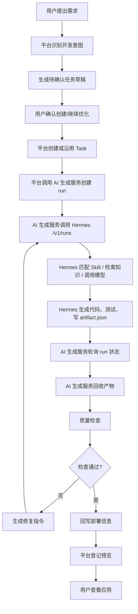

# 平台与 Hermes 交互流程及接口清单

日期：2026-07-03

本文档整理平台与 Hermes/AI 生成服务之间的交互边界，分为两个部分：

1. 接口清单：拆分 AI 生成服务 Docker 后，各模块需要暴露或调用的接口。
2. 交互流程：从用户提出需求到产物部署、查看的完整主线。

本文不覆盖管理端/用户端工单页面实现，只描述 AI 生成、Skill、产物测试部署、工单状态管理相关接口和流程。

## 一、接口清单

### 1.1 服务边界

建议拆分出独立服务：

```text
ai-generation-service
```

该服务负责：

- Hermes Agent 调用与 run 轮询。
- 模型网关适配。
- Skill 匹配、加载、导出。
- RAGFlow/外部搜索增强。
- 文件型工作目录管理。
- 代码生成后的质量检查。
- 工单生成状态推进。
- 产物信息回写平台。

平台主服务保留：

- 用户、租户、权限。
- 工单记录 DB。
- 聊天/确认交互。
- 预览访问入口。
- 部署登记。
- 前端状态展示。

### 1.2 平台调用 AI 生成服务

平台在用户确认需求后调用 AI 生成服务。

| 接口 | 方法 | 说明 |
| --- | --- | --- |
| `/api/ai/health` | `GET` | AI 生成服务健康检查 |
| `/api/ai/runtime/status` | `GET` | 查询 Hermes、模型网关、RAGFlow、Skill 状态 |
| `/api/ai/runs` | `POST` | 创建 AI 生成 run |
| `/api/ai/runs/{run_id}` | `GET` | 查询 AI 生成 run 状态 |
| `/api/ai/runs/{run_id}/events` | `GET` / SSE | 获取 Hermes/AI 生成日志流 |
| `/api/ai/runs/{run_id}/cancel` | `POST` | 停止生成 |
| `/api/ai/runs/{run_id}/retry` | `POST` | 重试生成 |
| `/api/ai/tasks/{task_id}/resume` | `POST` | 沿用原任务编号继续优化 |
| `/api/ai/tasks/{task_id}/artifacts` | `GET` | 获取生成产物元数据 |
| `/api/ai/tasks/{task_id}/quality` | `POST` | 触发质量检查 |

#### POST `/api/ai/runs`

请求示例：

```json
{
  "task_id": "T-xxx",
  "tenant_id": "tenant-xxx",
  "user_id": "user-xxx",
  "title": "任务标题",
  "markdown": "完整需求 Markdown",
  "mode": "create",
  "base_task_id": null,
  "runtime_secrets": {
    "TUSHARE_TOKEN": "***"
  },
  "workspace": {
    "container_runtime_root": "/opt/data/task-runtime/task-runtime",
    "task_work_order_dir": "/opt/data/task-runtime/task-runtime/staging/work-orders/T-xxx",
    "task_staging_dir": "/opt/data/task-runtime/task-runtime/staging/work-orders/T-xxx"
  },
  "skill_context": "匹配到的 Skill 摘要",
  "repair_instruction": null,
  "constraints": {
    "no_mock_data": true,
    "real_api_required": true,
    "dependency_free_node_server": true,
    "preview_subpath_safe": true
  }
}
```

返回示例：

```json
{
  "run_id": "run_xxx",
  "task_id": "T-xxx",
  "status": "running",
  "current_node": "CODING",
  "summary": "Hermes work loop is running.",
  "artifacts": [],
  "next_action": "wait"
}
```

状态枚举建议：

```text
queued
running
completed
failed
pending_approval
cancelled
```

### 1.3 AI 生成服务调用平台

AI 生成服务需要向平台回写状态、事件、产物和部署信息。

| 接口 | 方法 | 说明 |
| --- | --- | --- |
| `/api/platform/tasks/{task_id}` | `GET` | 获取任务详情、payload、历史状态 |
| `/api/platform/tasks/{task_id}/context` | `GET` | 获取多轮上下文、原任务、附件摘要 |
| `/api/platform/tasks/{task_id}/status` | `POST` | 推进任务状态 |
| `/api/platform/tasks/{task_id}/events` | `POST` | 写入事件、日志、Hermes 输出 |
| `/api/platform/tasks/{task_id}/artifacts` | `POST` | 保存 Hermes 结果、生成产物、测试结果 |
| `/api/platform/tasks/{task_id}/deployment` | `POST` | 写入部署/预览信息 |
| `/api/platform/tasks/{task_id}/secrets` | `GET` | 获取运行时密钥，必须受平台权限控制 |

当前代码中已存在的近似接口：

| 当前接口 | 说明 |
| --- | --- |
| `/api/v1/tasks/{task_id}` | 读取任务详情 |
| `/api/v1/tasks/{task_id}/events` | 读取任务事件 |
| `/api/v1/tasks/{task_id}/context` | 读取任务上下文 |
| `/api/v1/tasks/{task_id}/deployment` | 读取部署信息 |
| `/api/v1/tasks/{task_id}/preview/` | 预览产物 |
| `/api/v1/hermes/tools/{tool_name}` | Hermes 后端工具统一入口 |

### 1.4 状态回写接口

建议 AI 生成服务通过统一状态接口推进平台状态。

#### POST `/api/platform/tasks/{task_id}/status`

请求示例：

```json
{
  "from_status": "CODING",
  "to_status": "TESTING",
  "event_type": "HERMES_WORK_LOOP_QA_READY",
  "message": "Hermes produced delivery output; quality checks are running.",
  "error_detail": null,
  "payload_patch": {
    "execution_runtime": "hermes",
    "workflow_owner": "hermes",
    "hermes_work_loop_status": "completed",
    "hermes_work_loop_run_id": "run_xxx"
  },
  "idempotency_key": "T-xxx:hermes:qa-ready:run_xxx"
}
```

### 1.5 任务状态枚举

AI 生成链路需要管理以下状态：

| 状态 | 说明 | 推进方 |
| --- | --- | --- |
| `CREATED` | 任务已创建 | 平台 |
| `ANALYZING` | AI 开始解析需求 | AI 生成服务 |
| `ROUTING` | 匹配 Skill / 判断执行路径 | AI 生成服务 |
| `CODING` | Hermes 生成中 | AI 生成服务 |
| `TESTING` | 生成后质量检查 | AI 生成服务 |
| `DEPLOYING` | 产物交给平台部署 | AI 生成服务或平台 |
| `COMPLETED` | 可预览完成 | 平台确认 |
| `FAILED` | 失败 | AI 生成服务或平台 |
| `PENDING_APPROVAL` | 需要人工介入 | AI 生成服务 |

### 1.6 Hermes Tool 接口

当前已有统一入口：

```text
POST /api/v1/hermes/tools/{tool_name}
```

当前支持：

| tool_name | 说明 |
| --- | --- |
| `task_draft.create` | 创建任务草稿 |
| `task_draft.get_pending` | 获取待确认任务草稿 |
| `task_draft.update` | 更新任务草稿 |
| `task_draft.reject` | 拒绝任务草稿 |
| `task.confirm_create` | 确认创建任务 |
| `task.transition` | 推进任务状态 |
| `task_artifact.save` | 保存任务产物 |
| `task_artifact.get` | 获取任务产物 |

拆分后建议最少保留：

- `task.transition`
- `task_artifact.save`
- `task_artifact.get`

如果任务草稿仍由平台聊天侧管理，则 `task_draft.*` 可以留在平台主服务，不需要进入 AI 生成服务。

### 1.7 Skill 管理接口

AI 生成服务负责 Skill 选择、加载、导出；平台可以只保留管理页面。

建议接口：

| 接口 | 方法 | 说明 |
| --- | --- | --- |
| `/api/ai/skills` | `GET` | Skill 列表 |
| `/api/ai/skills` | `POST` | 新增 Skill |
| `/api/ai/skills/{skill_id}` | `GET` | Skill 详情 |
| `/api/ai/skills/{skill_id}` | `PATCH` | 更新 Skill |
| `/api/ai/skills/{skill_id}` | `DELETE` | 删除或归档 Skill |
| `/api/ai/skills/match` | `POST` | 根据需求匹配 Skill |
| `/api/ai/skills/export/hermes` | `POST` | 导出为 Hermes `SKILL.md` |
| `/api/ai/skills/reload` | `POST` | 通知 Hermes 重新加载 Skill |

当前平台已有管理接口：

```text
GET    /api/v1/admin/skills
POST   /api/v1/admin/skills
GET    /api/v1/admin/skills/{skill_id}
PATCH  /api/v1/admin/skills/{skill_id}
DELETE /api/v1/admin/skills/{skill_id}
```

当前相关服务：

- `workflow_skill_service.py`
- `workflow_skill_exporter.py`
- `task_factory_service.match_skills`
- `platform_portal_service` 中的 Skill CRUD

### 1.8 模型网关接口

AI 生成服务内部调用模型网关。

当前兼容代理接口：

```text
GET  /api/v1/hermes-openai/v1/models
POST /api/v1/hermes-openai/v1/chat/completions
POST /api/v1/hermes-openai/v1/responses
```

建议 AI 生成服务内部保留：

| 接口 | 说明 |
| --- | --- |
| `/v1/models` | 模型列表 |
| `/v1/chat/completions` | Chat Completions 兼容 |
| `/v1/responses` | Responses 兼容 |

当前代理具备：

- 空回复重试。
- Responses output item 规范化。
- 上游模型网关超时/错误转换。

### 1.9 RAGFlow / 搜索增强接口

AI 生成服务内部调用 RAGFlow 和外部搜索。

建议接口：

| 接口 | 方法 | 说明 |
| --- | --- | --- |
| `/api/ai/knowledge/search` | `POST` | 查询知识库 |
| `/api/ai/research/search` | `POST` | 外部搜索 |
| `/api/ai/research/extract` | `POST` | 页面提取/摘要 |

降级规则：

- RAGFlow 不可用时，不阻断生成。
- 外部搜索不可用时，不阻断生成。
- 需要在 run event 中记录降级原因。

### 1.10 Hermes Agent 接口

AI 生成服务调用 Hermes Agent：

| Hermes 接口 | 方法 | 说明 |
| --- | --- | --- |
| `/v1/runs` | `POST` | 创建 Hermes work-loop |
| `/v1/runs/{run_id}` | `GET` | 查询 run 状态 |
| `/v1/runs/{run_id}/events` | `GET` / SSE | 获取工具调用和模型输出事件 |

平台不建议直接调用 Hermes Agent。平台应只调用 `ai-generation-service`，由 AI 服务屏蔽 Hermes 细节。

### 1.11 产物目录契约

AI 生成服务必须写入平台约定目录：

```text
{task_work_order_dir}/source/
{task_work_order_dir}/source/index.html
{task_work_order_dir}/source/artifact.json
{task_work_order_dir}/source/server/index.js
{task_work_order_dir}/source/package.json
```

`artifact.json` 示例：

```json
{
  "status": "completed",
  "project_root": "/opt/data/task-runtime/task-runtime/staging/work-orders/T-xxx/source",
  "frontend_entry": "/opt/data/task-runtime/task-runtime/staging/work-orders/T-xxx/source/index.html",
  "backend_entry": "/opt/data/task-runtime/task-runtime/staging/work-orders/T-xxx/source/server/index.js",
  "build_dir": "/opt/data/task-runtime/task-runtime/staging/work-orders/T-xxx/source/dist",
  "test_result": {
    "passed": true,
    "checks": []
  },
  "summary": "生成完成"
}
```

### 1.12 产物约束

Web / 后端代理类任务必须遵守：

- 前端入口必须可直接预览。
- 不允许只输出 React/Vite 源码而没有可访问入口。
- 静态资源必须使用相对路径。
- 后端代理必须使用 JS/TS。
- 当前平台预览运行时不会自动执行 `npm install`。
- 生成的 Node server 应优先使用原生 `http/url/fs/path`，不能依赖 Express/Fastify/Koa/Axios 等需要安装的包。
- 涉及外部 API 时必须真实请求，不允许 mock 替代。
- 接口失败、空结果、网络异常必须显示真实中文错误或空状态。

## 二、平台与 Hermes 交互流程

### 2.1 总览流程



### 2.2 需求提出

用户在平台聊天页输入需求。

平台负责：

- 判断普通聊天还是开发需求。
- 提取标题、需求正文、附件、运行密钥。
- 判断是否为新建任务或多轮优化。
- 生成待确认任务草稿。

Hermes 可以参与：

- 意图判断。
- 需求增强。
- 外部检索/RAGFlow 查询。

但此时还没有正式生成代码。

### 2.3 确认创建或继续优化

用户点击确认后：

新建任务：

- 平台生成新的 `task_id`。
- 状态进入 `CREATED`。

继续优化：

- 平台沿用原任务编号。
- 新需求写入原任务 payload。
- 不能默认新建继承任务，除非用户明确要求。

之后平台状态推进：

```text
CREATED -> ANALYZING -> ROUTING -> CODING
```

### 2.4 平台投递 AI 生成服务

平台调用：

```text
POST /api/ai/runs
```

AI 生成服务收到后：

- 保存 run 记录。
- 准备 Hermes payload。
- 注入 workspace 目录约束。
- 注入 Skill context。
- 注入 repair instruction。
- 注入 runtime secrets 引用。
- 调用 Hermes Agent。

### 2.5 AI 生成服务调用 Hermes

AI 生成服务调用：

```text
POST /v1/runs
```

Hermes 负责：

- 分析需求。
- 匹配 Skill。
- 调用模型。
- 使用 RAGFlow/搜索增强。
- 生成代码。
- 写入工作目录。
- 运行测试。
- 返回 run 状态。

### 2.6 Hermes 生成产物

Hermes 必须把产物写入：

```text
{task_work_order_dir}/source
```

最少产物：

```text
source/index.html
source/styles.css
source/app.js
source/package.json
source/server/index.js
source/artifact.json
```

如果使用构建目录：

```text
source/dist/index.html
source/dist/app.js
source/dist/styles.css
```

### 2.7 AI 生成服务轮询 Hermes

AI 生成服务轮询：

```text
GET /v1/runs/{run_id}
GET /v1/runs/{run_id}/events
```

处理规则：

| Hermes 状态 | AI 生成服务处理 |
| --- | --- |
| `running` | 继续轮询，并回写平台事件 |
| `completed` | 回收产物，进入质量检查 |
| `failed` | 平台任务标记失败 |
| `pending_approval` | 平台任务进入待人工介入 |
| 长时间 running 但目录已有完整产物 | 启动 staging 产物回收兜底 |

### 2.8 产物回收

AI 生成服务读取：

```text
source/artifact.json
```

并确认：

- `frontend_entry` 存在。
- `backend_entry` 存在。
- 静态资源引用完整。
- 目录未越界。
- 可复制到平台 workspace。

如果 Hermes 一直不返回 completed，但 staging 目录已有完整可检查产物，可以按兜底策略回收。

### 2.9 质量检查

AI 生成服务或平台质量检查模块检查：

- 是否有可访问入口。
- 是否有缺失资源。
- 是否存在运行时错误。
- 是否使用真实 API。
- 是否误用 mock 数据。
- 是否依赖未安装 npm 包。
- 是否展示空状态/错误状态。
- 是否符合任务要求。

检查通过：

```text
CODING -> TESTING -> DEPLOYING -> COMPLETED
```

检查失败：

```text
TESTING -> CODING
```

并生成：

```json
{
  "quality_failure": {
    "code": "BACKEND_PROXY_MISSING",
    "message": "生成产物缺少后端代理",
    "solution": "补齐 server/index.js",
    "reprompt_hint": "请修复后重新提交"
  },
  "hermes_repair_instruction": {
    "mode": "repair_previous_delivery",
    "required_action": "继续修复原产物"
  }
}
```

### 2.10 部署登记

质量检查通过后，平台登记 deployment：

```json
{
  "title": "应用标题",
  "source": "hermes_work_loop_artifact",
  "project_dir": "/app/.data/task-runtime/T-xxx/workspace",
  "preview_url": "/api/tasks/T-xxx/preview/",
  "endpoint_url": "/api/tasks/T-xxx/preview/",
  "runtime_status": "running"
}
```

平台状态：

```text
DEPLOYING -> COMPLETED
```

### 2.11 用户查看产物

用户访问：

```text
http://localhost:18080/apps/{task_id}
```

平台应用页内部加载：

```text
http://localhost:8001/api/tasks/{task_id}/preview/
```

如果产物调用同源 API，例如：

```text
/api/usgs/earthquakes
/api/tushare/daily
```

平台通过 runtime proxy 转发：

```text
/api/tasks/{task_id}/runtime/{runtime_path}
```

实际链路：

```text
用户浏览器
 -> 平台应用页
 -> iframe preview
 -> workspace/index.html
 -> app.js fetch('/api/xxx')
 -> 平台 runtime proxy
 -> 生成的 Node server
 -> 真实外部 API
```

### 2.12 多轮优化流程

多轮优化不应新建任务，除非用户明确要求。

流程：

```text
用户提出优化要求
 -> 平台识别 base_task_id
 -> 平台沿用原 task_id
 -> payload 写入 refinement/repair instruction
 -> AI 生成服务读取原产物
 -> Hermes 修复原项目
 -> 质量检查
 -> 覆盖原部署
 -> 用户查看同一 task_id 的更新结果
```

### 2.13 异常与降级

| 异常 | 处理 |
| --- | --- |
| 模型网关空回复 | 重试最多 3 次 |
| Hermes run 一直 running | 轮询；若 staging 产物完整则兜底回收 |
| RAGFlow 不可用 | 记录降级，不阻断 |
| 外部搜索不可用 | 记录降级，不阻断 |
| 质量检查失败 | 生成 repair instruction，重新投递 Hermes |
| Node 运行时缺依赖 | 判定质量失败，要求无依赖 server |
| 真实 API 失败 | 页面必须展示真实错误/空状态 |

## 三、推荐拆分后的最小接口集合

如果只保留你负责的 AI 生成、Skill、状态管理，最小接口集合如下：

### AI 生成服务对平台暴露

```text
GET  /api/ai/health
GET  /api/ai/runtime/status
POST /api/ai/runs
GET  /api/ai/runs/{run_id}
GET  /api/ai/runs/{run_id}/events
POST /api/ai/runs/{run_id}/cancel
POST /api/ai/runs/{run_id}/retry
POST /api/ai/tasks/{task_id}/resume
GET  /api/ai/tasks/{task_id}/artifacts
POST /api/ai/tasks/{task_id}/quality
GET  /api/ai/skills
POST /api/ai/skills
GET  /api/ai/skills/{skill_id}
PATCH /api/ai/skills/{skill_id}
DELETE /api/ai/skills/{skill_id}
POST /api/ai/skills/match
POST /api/ai/skills/export/hermes
POST /api/ai/skills/reload
```

### AI 生成服务调用平台

```text
GET  /api/platform/tasks/{task_id}
GET  /api/platform/tasks/{task_id}/context
POST /api/platform/tasks/{task_id}/status
POST /api/platform/tasks/{task_id}/events
POST /api/platform/tasks/{task_id}/artifacts
POST /api/platform/tasks/{task_id}/deployment
GET  /api/platform/tasks/{task_id}/secrets
```

### AI 生成服务调用 Hermes / 模型 / 知识库

```text
POST /v1/runs
GET  /v1/runs/{run_id}
GET  /v1/runs/{run_id}/events

GET  /v1/models
POST /v1/chat/completions
POST /v1/responses

POST /api/ai/knowledge/search
POST /api/ai/research/search
POST /api/ai/research/extract
```

## 四、结论

拆分后，平台和 Hermes/AI 生成服务的边界应保持清晰：

- 平台负责用户、任务、权限、预览入口、部署登记和展示。
- AI 生成服务负责需求到产物的生成、Skill、Hermes、模型、RAG、测试和状态推进。
- Hermes 是 AI 生成服务内部执行器，不建议由平台前端或主服务直接调用。
- 平台不应再保留另一套内置业务页面生成链路。
- 所有生成产物必须通过统一目录契约和 `artifact.json` 回传，避免出现“页面显示的不是 Hermes 输出”的问题。
